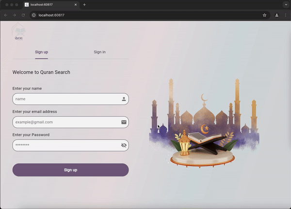

<p align="center">

<br/>

# Quran Search Web Application

This project is a simple Quran search web application where users can search for specific Quranic verses in English. It includes functionality for Authentication pages and searchable interface.

## Key Features

1. Authentication for real login functionality.
2. Search Page:
    - Users can search for verses across the Quran using keywords.
    - A real-time search bar dynamically displays results below it.

## Requirements

 In order to run the web, this project requires a Dart SDK and Flutter SDK.

1. install dart SDK
 install dart SDK from [dart documentation](https://dart.dev/get-dart)

2. install flutter SDK
 install or upgrade the latest version of Flutter from these installation [guides](https://docs.flutter.dev/get-started/install)

## How to run the project

1. Open terminal or CMD.
2. Clone the Repository, such as 
```bash
git clone https://github.com/Amjad-elahi/Quran.git
```
3. Navigate to the project path, such as 
```bash
cd quran
```
4. open the project in VS Code, such as 
```bash
code .
``` 
5. Install Dependencies with a command:
```bash
flutter pub get
```
6. Choose the device for example a chrome

7. Run the web with a command: 
```bash
flutter run
```
 ## Web Flow 
1. Authentication page (sign up or sign in)
   - Users can sign up/in with their email and password
2. search page
   - searching for a word as general search (in all the quran)
   - searching for a word in specific surah

## Challenges Faced
1.	Real-Time Search Performance:
    -	Optimizing results display to handle large datasets efficiently.

## Sample Output

<p align="center">

<br/>

<p align="center">

<br/>

## Created by
[Amjad Elahi](https://github.com/Amjad-elahi)


